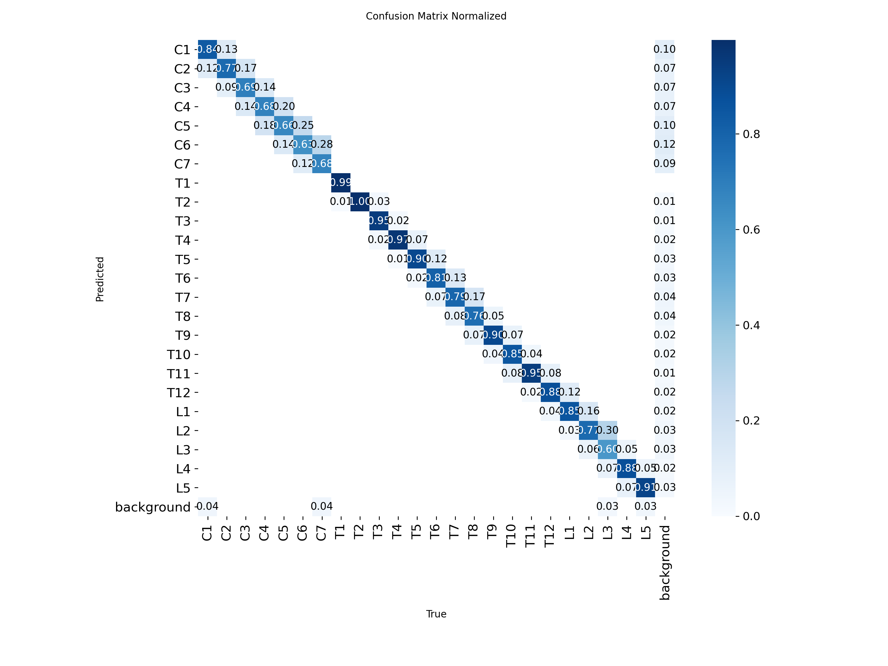
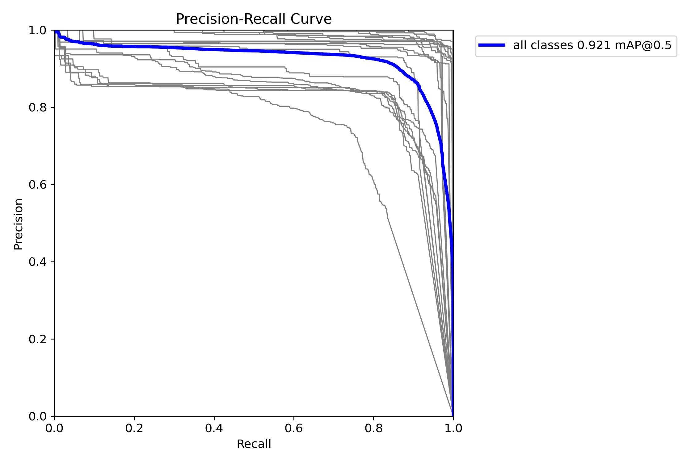
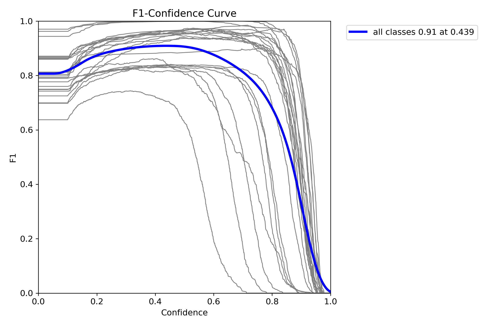
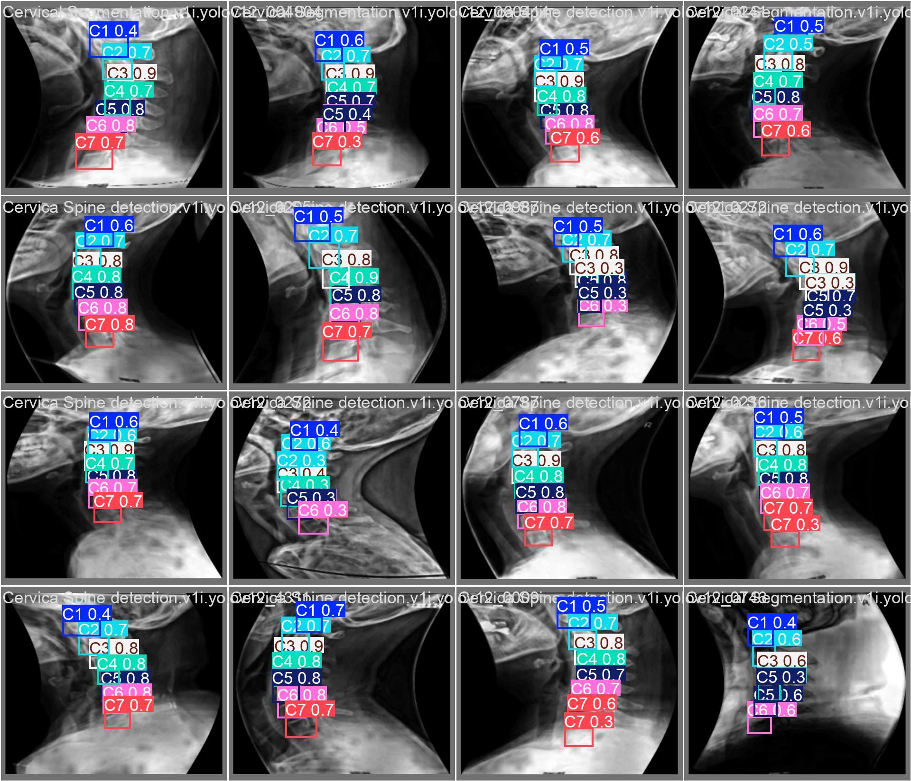
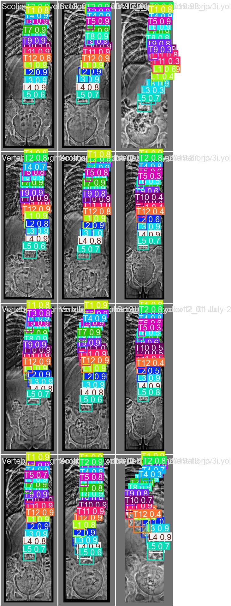

# Автоматическая детекция позвонков на рентгеновских снимках


Прототип системы для автоматической детекции и классификации позвонков на рентгеновских снимках с использованием YOLOv12. Проект выполнен в рамках тестового задания на позицию стажёра-инженера по машинному обучению в Pirogov.AI.

## 📋 Содержание

- [О проекте](#-о-проекте)
- [Результаты](#-результаты)
- [Архитектура решения](#️-архитектура-решения)
- [Структура проекта](#-структура-проекта)
- [Установка и запуск](#-установка-и-запуск)
- [Датасеты](#-датасеты)
- [Пайплайн обработки данных](#-пайплайн-обработки-данных)
- [Обучение модели](#-обучение-модели)
- [Анализ ошибок](#-анализ-ошибок)
- [План развития](#-план-развития)
- [Технический стек](#-технический-стек)

## 🎯 О проекте

Система решает задачу **детекции и классификации позвонков** на рентгеновских снимках позвоночника. Модель определяет местоположение каждого позвонка и присваивает ему правильный класс (C1-C7, T1-T12, L1-L5).

Проект демонстрирует полный цикл работы ML-инженера: от поиска и анализа данных до обучения модели, анализа ее ошибок и планирования дальнейшего развития продукта для решения прикладных медицинских задач, таких как диагностика остеохондроза.

### Ключевые особенности

- ✅ Детекция 24 классов позвонков (C1-C7, T1-T12, L1-L5).
- ✅ Обработка и объединение разнородных датасетов с разными форматами аннотаций.
- ✅ Глубокая проработка пайплайна предобработки и аугментации данных.
- ✅ Достижение **mAP@0.5 = 0.921** и **F1-Score = 0.91** на тестовой выборке.
- ✅ Разработан GUI-инструмент для визуального анализа и подбора гиперпараметров.

## 📊 Результаты

### Финальные метрики (YOLOv12n, 30 эпох)

После итеративной работы над качеством данных и пайплайном обработки была выбрана модель YOLOv12n, показавшая оптимальный баланс между точностью и скоростью на имеющемся объеме данных.

| Метрика | Значение |
|---|---|
| **Precision** | 0.894 |
| **Recall** | 0.927 |
| **mAP@0.5** | **0.921** |
| **mAP@0.5-0.95** | 0.556 |
| **F1-Score** | **0.91** |
| **Confidence** | 0.439 |

### Эволюция решения

Первые эксперименты показали низкую точность и проблемы с переобучением. Стало очевидно, что ключ к успеху лежит в качестве данных, а не в сложности модели.

| Этап | Модель | Эпохи | F1-Score | Confidence | Проблема и решение |
|---|---|---|---|---|---|
| 1️⃣ **Базовый (YOLOv12n)** | YOLOv12n | 20 | 0.72 | 0.359 | Низкое качество из-за недостаточной аугментации. |
| 2️⃣ **Увеличение модели** | YOLOv12m | 100 | 0.73 | 0.358 | **Переобучение после 20-й эпохи.** Модель слишком сложная для текущего датасета. |
| 3️⃣ **Упрощение аугментации** | YOLOv12n | 20 | 0.71 | 0.344 | Быстрое переобучение, низкая точность. Подтвердило важность качественной аугментации. |
| 4️⃣ **Финальный (YOLOv12n)** | YOLOv12n | 30 | **0.91** | **0.439** | ✅ **Проработан пайплайн данных:** улучшена нормализация и аугментация. Удалены некачественно размеченные изображения. Выбрано оптимальное число эпох (30) и легковесная модель. |

### Результаты по классам

Анализ метрик по каждому классу выявил системную проблему: модель значительно хуже распознает крайние позвонки (C1, L5), что связано с неполной разметкой в исходных данных.

| Отдел | Позвонки | Средний mAP@0.5 | Особенности |
|---|---|---|---|
| **Шейный (C1-C7)** | C1-C7 | 0.807 | C1 показывает наименьшую точность (0.721) из-за частичной разметки в датасетах. |
| **Грудной (T1-T12)** | T1-T12 | **0.987** | **Отличные результаты.** T1-T3 достигают 0.995, что подтверждает эффективность модели при полной разметке. |
| **Поясничный (L1-L5)** | L1-L5 | 0.926 | L5 имеет наименьшую точность (0.864) из-за частого отсутствия на снимках или неполной разметки. |

<details>
<summary>Детальная таблица метрик по классам (нажмите, чтобы развернуть)</summary>

| Класс | Изображений | Экземпляров | Точность (P) | Полнота (R) | mAP@0.5 | mAP@0.5-0.95 |
|:---|---:|---:|---:|---:|---:|---:|
| **Все классы** | **1082** | **10442** | **0.894** | **0.927** | **0.921** | **0.556** |
| **C1** | 780 | 780 | 0.781 | 0.641 | 0.721 | 0.289 |
| **C2** | 788 | 788 | 0.830 | 0.829 | 0.842 | 0.445 |
| **C3** | 788 | 788 | 0.826 | 0.853 | 0.806 | 0.459 |
| **C4** | 788 | 788 | 0.831 | 0.844 | 0.800 | 0.459 |
| **C5** | 788 | 788 | 0.827 | 0.843 | 0.817 | 0.455 |
| **C6** | 788 | 788 | 0.811 | 0.849 | 0.819 | 0.458 |
| **C7** | 732 | 732 | 0.796 | 0.840 | 0.847 | 0.433 |
| **T1** | 294 | 294 | 0.998 | 1.000 | 0.995 | 0.707 |
| **T2** | 294 | 294 | 0.998 | 1.000 | 0.995 | 0.682 |
| **T3** | 294 | 294 | 0.997 | 1.000 | 0.995 | 0.590 |
| **T4** | 294 | 294 | 0.957 | 0.969 | 0.969 | 0.589 |
| **T5** | 294 | 294 | 0.905 | 0.990 | 0.983 | 0.622 |
| **T6** | 294 | 294 | 0.919 | 0.993 | 0.990 | 0.668 |
| **T7** | 294 | 294 | 0.895 | 1.000 | 0.992 | 0.675 |
| **T8** | 294 | 294 | 0.929 | 1.000 | 0.986 | 0.644 |
| **T9** | 294 | 294 | 0.918 | 0.995 | 0.981 | 0.643 |
| **T10**| 294 | 294 | 0.914 | 1.000 | 0.989 | 0.644 |
| **T11**| 294 | 294 | 0.928 | 1.000 | 0.993 | 0.623 |
| **T12**| 286 | 286 | 0.935 | 0.997 | 0.968 | 0.618 |
| **L1** | 294 | 294 | 0.937 | 0.969 | 0.950 | 0.569 |
| **L2** | 294 | 294 | 0.889 | 0.966 | 0.964 | 0.578 |
| **L3** | 294 | 294 | 0.858 | 0.912 | 0.901 | 0.593 |
| **L4** | 294 | 294 | 0.902 | 0.959 | 0.951 | 0.547 |
| **L5** | 294 | 294 | 0.875 | 0.811 | 0.864 | 0.357 |


</details>


Графики, сгенерированные во время обучения в папке `data/05_runs/spine_yolo12n_final/`, позволяют глубоко проанализировать поведение модели и подтвердить правильность выбранной стратегии.

### Матрица ошибок (Confusion Matrix)



Матрица ошибок наглядно показывает, какие классы модель путает между собой.

**Ключевые выводы:**
- **Сильная диагональ:** Ярко выраженная диагональ свидетельствует о высокой общей точности. Большинство предсказаний верны.
- **Ошибки на соседних позвонках:** Небольшие ошибки (светлые ячейки вне диагонали) в основном происходят между соседними позвонками, что является ожидаемым поведением.
- **В правом столбце значения на background а в строке background их меньше** Это говорит нам что модель боится предсказывать позвонки там где они есть, но редко предсказывает там где их нет.
- **Минимум ложных срабатываний:** Последняя строка (`background`) показывает, что модель редко предсказывает позвонки там, где их нет (минимум False Positives).

### Кривая Precision-Recall (PR-кривая)



PR-кривая показывает компромисс между точностью (Precision) и полнотой (Recall) при разных уровнях уверенности модели.

**Вывод:** Высокое значение площади под кривой (**mAP@0.5 = 0.921**) визуально подтверждается тем, что кривая для всех классов (`all`) находится близко к правому верхнему углу. Это говорит о высоком качестве модели.

### F1-кривая



Этот график является ключевым для выбора оптимального порога уверенности (`confidence threshold`).

**Вывод:** Пик кривой F1-score для всех классов достигается при пороге уверенности **~0.439**, что дает итоговое значение F1-score **0.91**. Именно этот порог является наилучшим балансом между точностью и полнотой, и он используется при оценке модели.

### Кривые обучения и валидации


Графики потерь (`loss`) и метрик на протяжении 30 эпох показывают, как проходил процесс обучения.

**Ключевые выводы:**
- **Стабильное обучение:** Все метрики потерь (`box_loss`, `cls_loss`, `dfl_loss`) для обучающей выборки (`train`) стабильно снижаются, что говорит об успешном процессе обучения.
- **Отсутствие переобучения:** Кривые потерь для валидационной выборки (`val`) следуют за кривыми обучения и выходят на плато примерно к 30-й эпохе, не начиная расти (интересно что val/dfl_loss выходит в максимум на 5 эпохе а дальше начинает только ухудшаться, тогда, когда cls_loss уменьшается на протяжении всего обучения). Это подтверждает, что **30 эпох — оптимальная продолжительность обучения**, и модель не успела переобучиться.
- **Сходимость метрик:** Метрики mAP50 и Recall на валидации также выходят на плато, что свидетельствует о сходимости модели к своему наилучшему состоянию на данном наборе данных.

### Примеры предсказания модели




## 🏗️ Архитектура решения

### Выбор модели: YOLOv12n

**Обоснование выбора:**

1.  **Эффективность на малых датасетах**: YOLOv12n (nano) показала превосходные результаты на ~3.5 тыс. изображений, в то время как более крупная YOLOv12m (medium) начала быстро переобучаться.
2.  **Скорость инференса**: Важный фактор для потенциального развертывания в клинической практике.
3.  **Баланс точность/размер**: 3.0M параметров (nano) идеально подходят для задачи, не требуя избыточных вычислительных ресурсов.
4.  **Оптимальное количество эпох**: Эмпирически установлено, что 30 эпох достаточно для сходимости без переобучения при качественной предобработке данных.


Переход на сегментацию является логичным следующим шагом развития проекта после расширения датасета (см. [План развития](#-план-развития)).

## 📁 Структура проекта

```
pirogov-ai-spine-analysis/
│
├── data/
│   ├── 01_raw/                    # Исходные датасеты
│   ├── 02_processed/              # Объединенные и обработанные данные
│   └── 05_runs/                   # Результаты обучения (логи, веса)
│
├── scripts/
│   ├── 01_process_and_merge.py   # Объединение и унификация датасетов
│   ├── 02_augment_data.py        # Аугментация данных
│   ├── 03_clean_duplicate_labels.py  # Удаление дубликатов
│   ├── 04_normalize_data.py      # Нормализация изображений
│   ├── 06_visual_analyzer.py     # GUI для подбора гиперпараметров
│   └── 07_train_yolo12n.py       # Обучение модели
│
├── data.yaml                     # Конфигурация датасета для YOLO
├── DOMAIN_ANALYSIS.md            # Анализ медицинской предметной области
├── TEST_TASK.md                  # Формулировка задания   
└── README.md                     # Этот файл
```

## 🚀 Установка и запуск

### Требования

- Python 3.8+
- CUDA 11.8+ (для GPU)
- 16GB RAM (рекомендуется)

### Установка и запуск

```bash
# 1. Клонирование репозитория
git clone https://github.com/Vasja1142/pirogov-ai-spine-analysis-task.git
cd pirogov-ai-spine-analysis

# 2. Установка зависимостей
pip install -r requirements.txt

# 3. Запуск полного пайплайна
# Обработка и объединение датасетов
python scripts/01_process_and_merge.py

# Аугментация данных
python scripts/02_augment_data.py

# Удаление изображений с некачественной разметкой
python scripts/03_clean_duplicate_labels.py

# Нормализация изображений
python scripts/04_normalize_data.py

# 4. Обучение модели
python scripts/07_train_yolo12n.py

# 5. Оценка и инференс
# Оценка
yolo val model=data/05_runs/spine_yolo12n_final/weights/best.pt data=data.yaml

# Инференс на новом изображении
yolo predict model=data/05_runs/spine_yolo12n_final/weights/best.pt source=path/to/image.jpg
```

## 📦 Датасеты

Использовались 4 открытых датасета с платформ Roboflow, содержащие разметку для шейного, грудного и поясничного отделов позвоночника.
- Cervica Spine detection
- Cervical Segmentation
- Scoliosis
- Vertebrae Segmentation

### Проблемы с данными

⚠️ **Неполная разметка крайних позвонков**:
- **C7**: Размечен только в 72% снимков, где визуально присутствует.
- **C1**: Отсутствует в некоторых изображениях.

Эта проблема напрямую объясняет пониженную точность на крайних позвонках и является основной точкой роста для улучшения модели.

## 🔄 Пайплайн обработки данных

### Этап 1: Объединение и унификация (`01_process_and_merge.py`)

- Конвертация различных форматов аннотаций (COCO JSON, polygons) в единый YOLO-формат.
- Создание глобальной карты классов для всех датасетов.

### Этап 2: Аугментация данных (`02_augment_data.py`)

Применен гибридный подход, сочетающий стандартные и кастомные трансформации для создания медицински релевантных искажений:
- **Эластичная деформация** (Albumentations): имитирует естественные искривления позвоночника.
- **Вертикальный изгиб** (Custom `cv2.remap`): создает контролируемые синусоидальные изгибы.
- **Облачный шум** (Custom): имитирует вариации качества рентгеновских снимков.

### Этап 3: Нормализация (`04_normalize_data.py`)

Разработан многоступенчатый пайплайн для улучшения видимости границ позвонков:
1.  **Median Blur**: удаление мелкого шума.
2.  **Gamma Correction**: осветление темных областей.
3.  **CLAHE**: усиление локального контраста.
4.  **Z-Score Normalization**: стандартизация интенсивности пикселей.

### GUI-инструмент для анализа (`06_visual_analyzer.py`)

Для эффективного подбора гиперпараметров аугментации и нормализации было создано интерактивное приложение на Tkinter. Оно позволяет в реальном времени видеть результат применения трансформаций, что значительно ускорило итерации и позволило найти оптимальные параметры.


## 🎓 Обучение модели

### Конфигурация

- **Модель:** YOLOv12n (nano)
- **Гиперпараметры:**
    - `epochs`: 30 (оптимально для сходимости без переобучения)
    - `imgsz`: 640
    - `batch`: 64
    - `mosaic`: 1.0, 
    - `mixup`: 0.4, 
    - `degrees`: 15 (и другие встроенные аугментации YOLO)

## 🔍 Анализ ошибок

### Соотношение Recall и Precision

- **Recall (0.927) > Precision (0.894)**: Модель склонна находить почти все существующие позвонки, даже если это приводит к небольшому количеству ложных срабатываний. Для медицинских приложений это предпочтительное поведение, так как пропуск патологии (False Negative) является более критичной ошибкой, чем ложная тревога (False Positive).

## 🚀 План развития

### Краткосрочная перспектива (1-3 месяца)

#### 1. Полуавтоматическая доразметка данных
**Цель:** Устранить проблему неполной разметки крайних позвонков.
**Подход:**
1.  Применить обученную модель для детекции позвонков на всех изображениях.
2.  Автоматически отобрать изображения, где модель предсказала C1/L5 с низкой уверенностью.
3.  Эксперт (врач или ML-инженер) быстро корректирует только эти предложенные аннотации.
4.  Дообучить модель на исправленных данных.
**Ожидаемый эффект:** Повышение mAP@0.5 на крайних позвонках на 5-10% и улучшение общей робастности модели.

#### 2. Анализ "трудных" изображений
**Цель:** Выявить систематические ошибки модели, не связанные с разметкой.
**Подход:**
- Кластеризовать изображения с самыми низкими метриками.
- Проанализировать, есть ли корреляция между ошибками и характеристиками снимка (проекция, контрастность, наличие артефактов).

### Среднесрочная перспектива (3-6 месяцев)

#### 3. Масштабирование датасета и переход на Active Learning
**Цель:** Увеличить размер и разнообразие датасета до 10,000+ изображений.
**Стратегия:** Внедрить цикл **активного обучения**, где размечаются только те новые данные, на которых модель наименее уверена. Это позволит максимально эффективно использовать ресурсы на разметку.

#### 4. Переход на более мощные модели (YOLOv12s/m)
По мере роста датасета можно будет без переобучения использовать более мощные модели для дальнейшего повышения точности.

### Долгосрочная перспектива (6-12 месяцев)

#### 5. Переход на инстанс-сегментацию
**Цель:** Получать не просто рамки, а точные контуры позвонков. Это необходимо для анализа их формы и вычисления точных расстояний.
**План:**
1.  Автоматически сгенерировать черновые маски из bounding box с помощью моделей вроде SAM (Segment Anything Model).
2.  Вручную скорректировать маски.
3.  Обучить YOLOv12-seg.

#### 6. Детекция остеохондроза
**Цель:** Создать систему второго уровня для автоматического выявления признаков остеохондроза.
**Архитектура:**
1.  **Модуль сегментации (YOLOv12-seg):** Находит точные контуры всех позвонков.
2.  **Модуль извлечения признаков (Feature Extractor):** На основе масок вычисляет медицински значимые параметры:
    -   **Высота межпозвоночных дисков** (расстояние между контурами).
    -   **Наличие остеофитов** (анализ отклонений формы контура от нормы).
    -   **Признаки субхондрального склероза** (анализ интенсивности пикселей у границ позвонков).
    -   **Спондилолистез** (анализ смещения центров соседних позвонков).
3.  **Модуль классификации (Gradient Boosting):** Модель (XGBoost/LightGBM) принимает на вход табличные признаки и выносит вердикт о наличии и стадии остеохондроза для каждого сегмента.

**Почему Gradient Boosting?** Он отлично работает на структурированных данных, требует меньше данных для обучения по сравнению с end-to-end сетями и, что критически важно для медицины, его результаты **интерпретируемы** с помощью SHAP.

#### 7. Интерпретируемость и помощь врачу
**Цель:** Сделать систему не "черным ящиком", а полезным ассистентом для врача.
**Решение:** Визуализировать для врача не только диагноз, но и основания для него. Например, подсвечивать на снимке области, которые модель сочла аномальными (остеофиты, зоны склероза) и которые внесли наибольший вклад в ее решение (на основе SHAP values). Это повысит доверие к системе и ее клиническую ценность.

## 💻 Технический стек

- **Язык программирования:** Python
- **Основные библиотеки:** PyTorch, OpenCV, Albumentations, NumPy, Pandas
- **Инструменты:** Git, Tkinter
