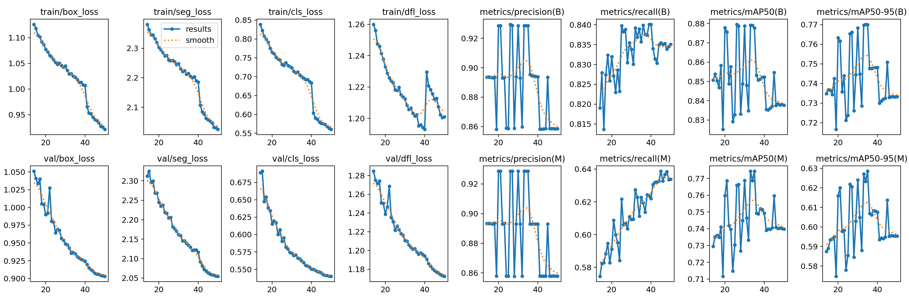
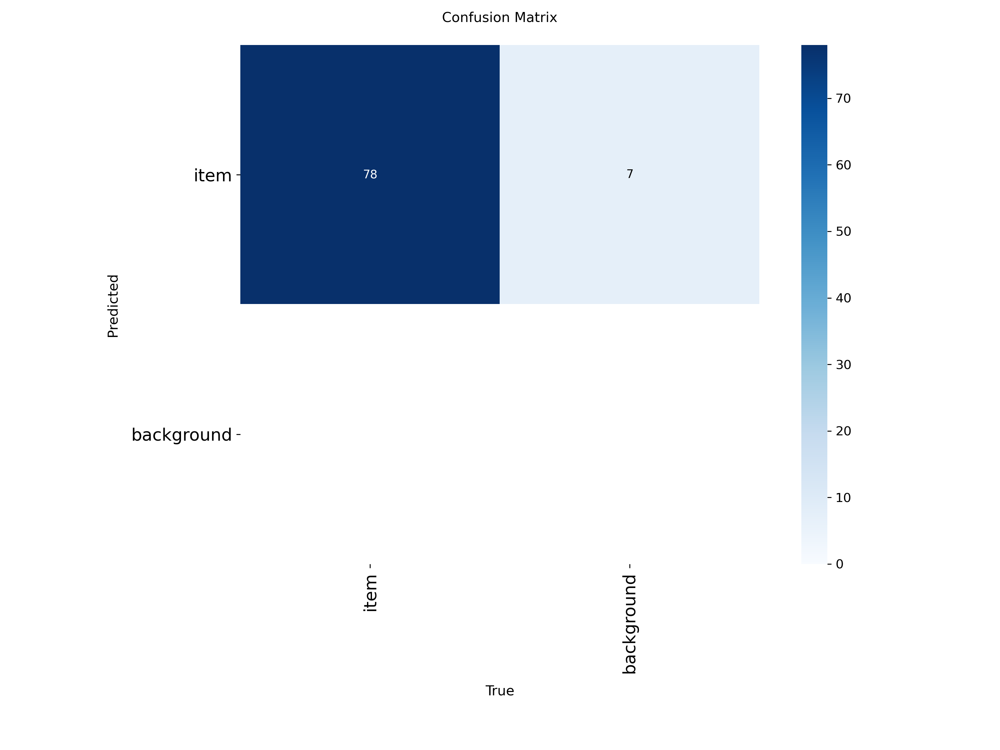
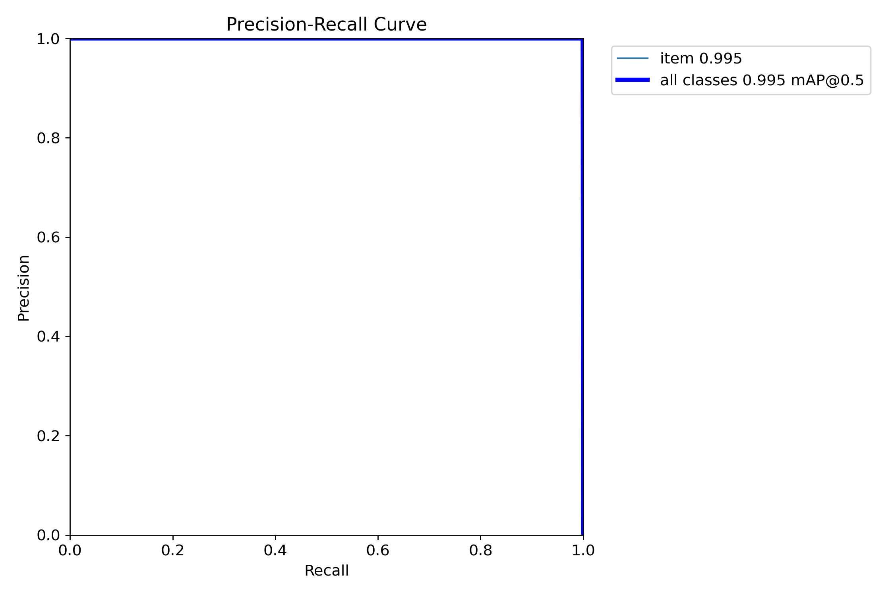
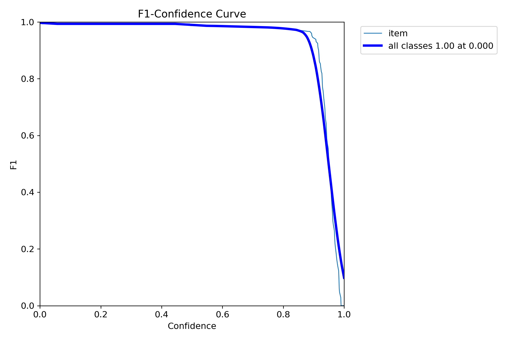
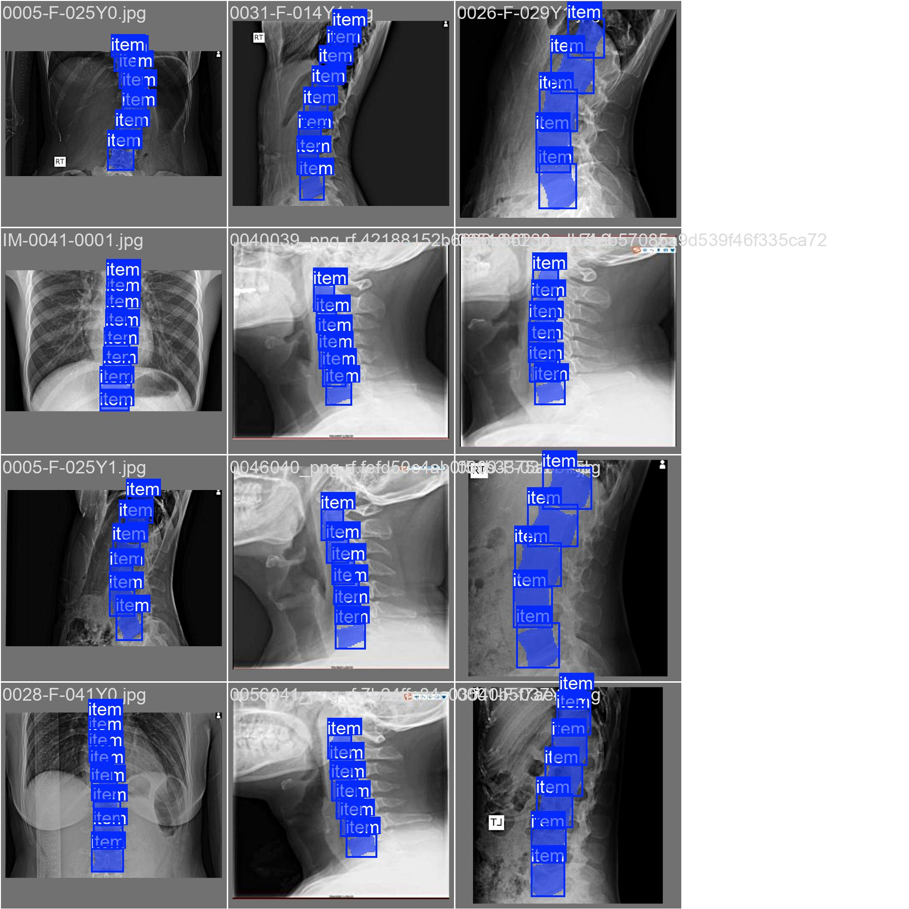

# Автоматическая сегментация позвонков на рентгеновских снимках

   

Система для автоматической сегментации позвонков на рентгеновских снимках с использованием новейшей архитектуры **YOLO11 Segmentation**. Проект находится на этапе разработки базовой модели для точного определения границ позвонков, что станет основой для последующего анализа патологий.

## 📋 Содержание

- [О проекте](#-о-проекте)
- [Ключевые особенности](#ключевые-особенности)
- [Архитектура решения](#️-архитектура-решения)
- [Структура проекта](#-структура-проекта)
- [Установка и запуск](#-установка-и-запуск)
- [Пайплайн обработки данных](#-пайплайн-обработки-данных)
- [Обучение модели](#-обучение-модели)
- [Результаты и метрики](#-результаты-и-метрики)
- [Автоматическая аннотация](#-автоматическая-аннотация)
- [Инструменты визуализации](#-инструменты-визуализации)
- [План развития](#-план-развития)
- [Технический стек](#-технический-стек)

## 🎯 О проекте

Система решает задачу **точной сегментации позвонков** на рентгеновских снимках позвоночника. Основная цель текущего этапа — обучить модель максимально точно определять границы каждого позвонка через полигональные маски.

### Текущий этап развития

**Одноклассовая сегментация (single-class)**
- Все позвонки размечаются как единый класс `item`
- Фокус на качестве определения границ, а не на классификации
- После достижения высокой точности сегментации планируется:
  1. Обучение отдельной легковесной модели для классификации позвонков (C1-C7, T1-T12, L1-L5)
  2. Извлечение геометрических признаков (векторы, расстояния, углы)
  3. Разработка системы детекции отклонений от нормы

### Ключевые особенности

- ✅ Переход на SOTA архитектуру **YOLO11** (улучшенная точность и скорость)
- ✅ Полигональная сегментация для точного определения контуров позвонков
- ✅ Продвинутый пайплайн предобработки с тремя вариантами нормализации
- ✅ Умная аугментация данных с медицински-релевантными трансформациями
- ✅ Автоматическая фильтрация и валидация полигонов после трансформаций
- ✅ Система полуавтоматической аннотации через CVAT/LabelStudio
- ✅ GUI-инструменты для визуализации и настройки параметров

## 🏗️ Архитектура решения

### Поэтапный подход к задаче

Проект использует **многоступенчатую стратегию** для достижения конечной цели — автоматизированной диагностики патологий позвоночника:

#### Этап 1 (ТЕКУЩИЙ): Точная сегментация
**Цель:** Обучить модель максимально точно определять границы позвонков

**YOLO11 Segmentation (nano/small)** с одноклассовой разметкой (`single_cls=True`):
- Все позвонки классифицируются как `item`
- Фокус на качестве масок сегментации, а не на распознавании типов позвонков
- Полигональные маски обеспечивают субпиксельную точность границ

**Почему одноклассовая разметка на первом этапе:**
1. Упрощает и ускоряет процесс начальной разметки
2. Позволяет сосредоточиться на качестве сегментации
3. Избегает ошибок классификации на этапе разметки

#### Этап 2 (ПЛАНИРУЕТСЯ): Классификация позвонков
**Цель:** Определить тип каждого сегментированного позвонка

После достижения высокой точности сегментации:
- Обучение **легковесной модели-классификатора** (CNN или ViT-tiny)
- Вход: вырезанное изображение позвонка + контекст (соседние позвонки)
- Выход: класс позвонка (C1-C7, T1-T12, L1-L5) — 24 класса
- Подход позволяет раздельно оптимизировать сегментацию и классификацию

**Преимущества раздельного подхода:**
- Модульность: можно улучшать каждую часть независимо
- Эффективность: маленькая модель-классификатор работает быстрее
- Гибкость: легко добавить новые классы или изменить таксономию

#### Этап 3 (ПЛАНИРУЕТСЯ): Геометрический анализ
**Цель:** Извлечь медицински значимые параметры

На основе точных контуров позвонков:
- **Векторы осей позвонков** для оценки искривлений
- **Межпозвоночные расстояния** (высота дисков)
- **Угол Кобба** для количественной оценки сколиоза
- **Соотношения размеров** для детекции компрессионных переломов
- **Форма контуров** для выявления остеофитов и деформаций

#### Этап 4 (ПЛАНИРУЕТСЯ): Детекция патологий
**Цель:** Автоматическая диагностика отклонений от нормы

Модуль принятия решений на основе геометрических признаков:
- Сравнение с референсными значениями (база нормы)
- Детекция аномалий: остеохондроз, сколиоз, нестабильность сегментов
- Генерация структурированного отчёта для врача

## 📁 Структура проекта

```
pirogov-ai-spine-analysis/
│
├── data/
│   ├── 01_raw/                    # Исходные изображения и метки
│   ├── 02_processed/              # Обрезанные и изменённые изображения
│   ├── 03_augmented/              # Аугментированные данные
│   ├── 04_normalized/             # Нормализованные изображения
│   ├── 05_runs/                   # Результаты обучения
│   └── 06_verification_runs/      # Визуальная проверка разметки
│
├── images/                        # Примеры графиков метрик и скриншоты
│   ├── results.png
│   ├── confusion_matrix.png
│   └── ...
│
├── scripts/
│   ├── 01_process_data.py         # Обрезка и предобработка
│   ├── 03_augment_data.py         # Аугментация с трансформациями
│   ├── 04_normalize_data.py       # Универсальная нормализация (CLAHE)
│   ├── 04_simple_normalize_data.py # Упрощённая нормализация
│   ├── 05_verify_labels.py        # Визуальная проверка разметки
│   ├── 06_create_yaml.py          # Генерация dataset.yaml
│   ├── 07_train.py                # Обучение YOLO11-seg
│   ├── 08_predict_visualize_streamlit.py  # Streamlit-визуализация
│   ├── 09_auto_annotate.py        # Автоматическая аннотация
│   └── tuner_unified.py           # GUI для настройки параметров
│
├── lib/
│   └── image_processing.py        # Библиотека функций обработки
│
├── data.yaml                      # Конфигурация датасета
└── README.md                      # Этот файл
```

## 🚀 Установка и запуск

### Требования

- Python 3.8+
- CUDA 11.8+ (для GPU)
- **Ultralytics 8.3.0+** (для поддержки YOLO11)

### Установка

```bash
# 1. Клонирование репозитория
git clone https://github.com/yourusername/pirogov-ai-spine-analysis.git
cd pirogov-ai-spine-analysis

# 2. Установка зависимостей
pip install -r requirements.txt
```

### Полный пайплайн обработки данных

```bash
# Шаг 1: Обработка исходных данных (обрезка по вертикали, изменение размера)
python scripts/01_process_data.py

# Шаг 2: Аугментация данных
python scripts/03_augment_data.py

# Шаг 3: Нормализация изображений (выберите один из вариантов)
# Вариант A: Полная нормализация (Bilateral + CLAHE + Gamma + Sharpen)
python scripts/04_normalize_data.py --mode dataset --input data/03_augmented --output data/04_normalized

# Вариант B: Упрощённая нормализация (Bilateral + Auto-Levels + Sharpen)
python scripts/04_simple_normalize_data.py --input data/03_augmented --output data/04_normalized

# Шаг 4: Визуальная проверка разметки (опционально)
python scripts/05_verify_labels.py --base-dir data/04_normalized --split train --samples 10

# Шаг 5: Создание dataset.yaml
python scripts/06_create_yaml.py --path data/04_normalized --names "0:vertebra"
```

## 🔄 Пайплайн обработки данных

(Описание этапов 1-4 идентично предыдущей версии)

## 🎓 Обучение модели

### Конфигурация обучения (`07_train.py`)

Скрипт по умолчанию использует **YOLO11 Nano** (`yolo11n-seg.pt`).

```bash
python scripts/07_train.py \
  --data data/04_normalized/dataset.yaml \
  --epochs 50 \
  --batch 16 \
  --model-name yolo11n-seg.pt \
  --project-name data/05_runs \
  --experiment-name spine_segmentation_v11
```

**Ключевые параметры:**
- `task="segment"`: Режим сегментации
- `single_cls=True`: Все позвонки как один класс
- `augment=True`: Встроенные аугментации YOLO
- `patience=50`: Ранняя остановка при отсутствии улучшений
- `plots=True`: Генерация графиков метрик

## 📊 Результаты и метрики

В процессе обучения YOLO11 генерирует детальные отчеты. Ниже приведены примеры ключевых метрик, которые сохраняются в директории `images/` (оригиналы находятся в папке эксперимента `data/05_runs/...`).

### 1. Сводные результаты (Loss & Metrics)

*График показывает динамику падения функций потерь (Box Loss, Seg Loss) и роста метрик качества (Precision, Recall, mAP) по эпохам.*

### 2. Матрица ошибок (Confusion Matrix)

*Демонстрирует точность классификации пикселей и объектов. Помогает понять, насколько часто модель путает позвонки с фоном.*

### 3. Кривые точности-полноты (Precision-Recall & F1)
<p float="left">
  
  
</p>
*PR-кривая показывает баланс между точностью и полнотой при разных порогах уверенности. F1-кривая помогает выбрать оптимальный порог (confidence threshold) для инференса.*

### 4. Примеры предиктов (Validation Batch)
 | 
--- | ---
*Разметка (Ground Truth)* | *Предсказание модели (Prediction)*

## 🤖 Автоматическая аннотация

Скрипт `09_auto_annotate.py` реализует **полуавтоматический цикл разметки** для ускорения создания датасета.

**Пример использования:**
```bash
python scripts/09_auto_annotate.py \
  --input-dir data/new_unlabeled_images \
  --output-img-dir data/auto_labeled_images \
  --output-json data/auto_annotations.json \
  --model-path data/05_runs/spine_segmentation_v11/weights/best.pt \
  --conf-threshold 0.4 \
  --erosion-size 2 \
  --area-max-ratio 3.5 \
  --poly-epsilon-factor 0.008
```

## 🎨 Инструменты визуализации

### 1. Streamlit-визуализатор (`08_predict_visualize_streamlit.py`)

Интерактивное веб-приложение для сравнения предсказаний модели с Ground Truth.

```bash
streamlit run scripts/08_predict_visualize_streamlit.py -- \
  --model-path data/05_runs/spine_segmentation_v11/weights/best.pt \
  --image-dir data/04_normalized/images/test
```

### 2. Unified Tuner (`tuner_unified.py`)

GUI-приложение на Streamlit для интерактивной настройки параметров обработки.

```bash
streamlit run scripts/tuner_unified.py
```

## 🚀 План развития

### Этап 1: Совершенствование сегментации (ТЕКУЩИЙ)
- [x] Переход на YOLO11 для повышения mAP
- [ ] Расширение датасета через полуавтоматическую разметку (CVAT workflow)
- [ ] Достижение целевых метрик: mAP@0.5 > 0.95, IoU > 0.90

### Этап 2: Классификация позвонков
- [ ] Обучение классификатора (ViT/CNN) на вырезанных ROI

### Этап 3: Геометрический анализ
- [ ] Внедрение алгоритма расчета угла Кобба и высоты дисков

### Этап 4: Детекция патологий
- [ ] Создание базы "нормы" и модуля детекции отклонений

## 💻 Технический стек

**Основные инструменты:**
- **Python 3.8+**: Язык разработки
- **PyTorch 2.0+**: Фреймворк глубокого обучения
- **Ultralytics YOLO11**: Модель сегментации
- **OpenCV**: Обработка изображений
- **Albumentations**: Продвинутые аугментации
- **Streamlit**: Веб-интерфейсы и визуализация

**Вспомогательные библиотеки:**
- NumPy, Pandas: Работа с данными
- tqdm: Прогресс-бары
- PyYAML: Конфигурационные файлы

## 📝 Заключение

Проект активно развивается. Переход на **YOLO11** позволил улучшить качество детекции границ позвонков. Текущий фокус — масштабирование датасета и валидация метрик на широком спектре клинических случаев.